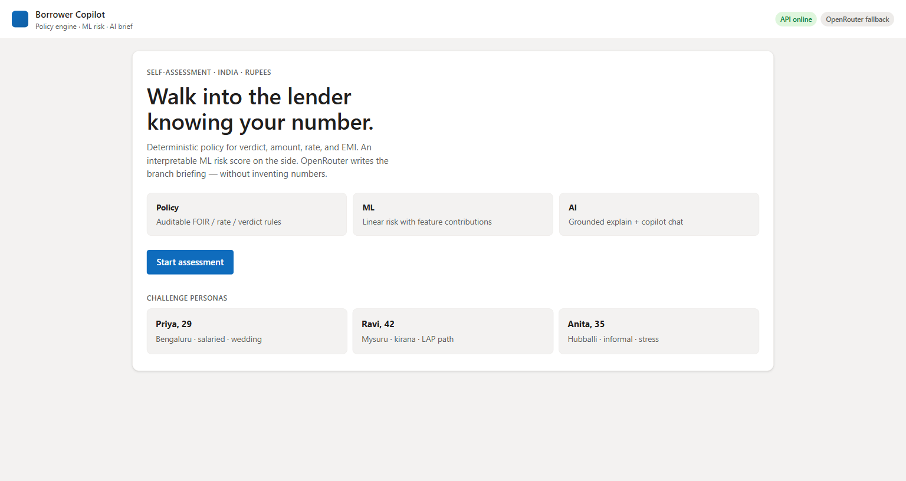
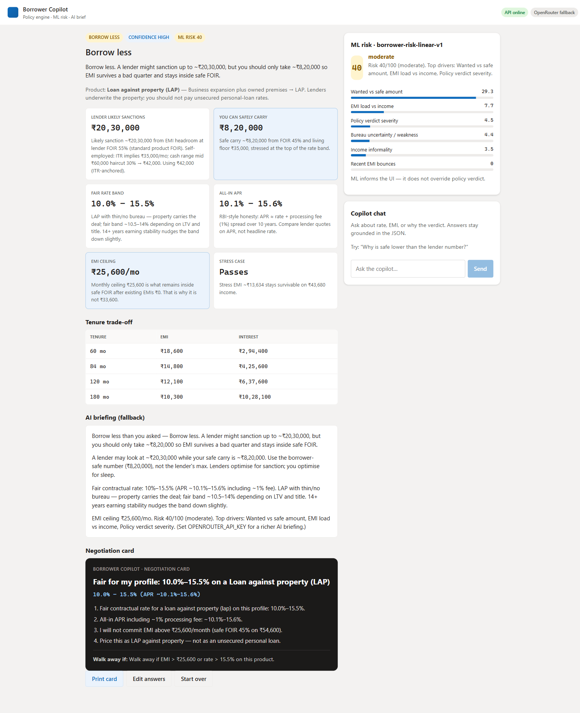
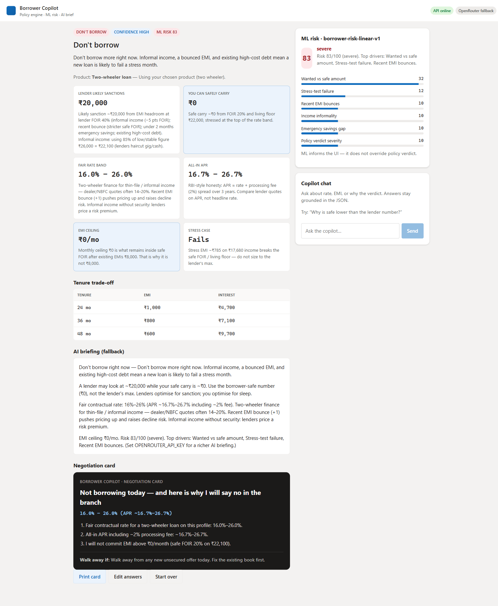

# Visual walkthrough (screen sequence)

Captured from the running app. This satisfies the five-minute walkthrough as a visual sequence; add `demo.mp4` yourself if you want a video.

## Beats

### 1. Home

Policy · ML · AI layers. Persona shortcuts for the brief.

### 2. Priya — borrow less

Lender ~₹17L vs safe ~₹7.4L. Fair **10.5–12.5%**. EMI cap ₹30k. ML risk low (score chip matches severity).

### 3. Ravi — LAP, borrow less

Routed to **loan against property**. Score unknown → wide band (not treated as 300).

### 4. Anita — don't borrow

**Don't borrow** fires on informal + bounce + high-cost debt.

## Script (what to say live)

See beat sheet in the table below and the narrative in [`../WALKTHROUGH.md`](../WALKTHROUGH.md).

| # | Say |
|---|-----|
| 1 | Self-assessment only — no bureau, nothing stored |
| 2 | Two amounts on purpose; use the safe one |
| 3 | Collateral → LAP; unknown score widens price |
| 4 | Don't is a real outcome, not decoration |

## Optional video

Record 4–6 min with Win+G / OBS covering beats 1–4. Save as `demo.mp4` here or link unlisted from `WALKTHROUGH.md`.
